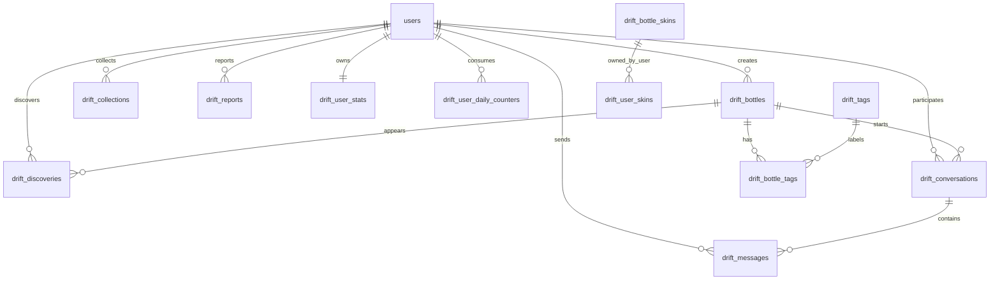

# 漂流瓶数据库设计

本文档基于 Stitch 项目 `漂流瓶` 的 5 个可见移动端页面，以及当前仓库的 Prisma/PostgreSQL 基础工程设计。当前仓库已有 `users`、认证、角色权限、系统配置等基础表；漂流瓶业务不重复设计用户体系，统一复用 `users.id`。

## 页面信息摘要

| 页面 | 关键业务信息 | 数据需求 |
| --- | --- | --- |
| 沧海拾音（探索） | 今日打捞 `5/5`、随机/音乐/树洞标签、捞起瓶子、底部导航 | 每日额度、发现记录、标签筛选、瓶子状态 |
| 瓶中尺素（阅读） | 来自深海的信息、内容文本、漂流天数、标签、音频进度、扔回大海、回信、举报 | 瓶子内容、多媒体、阅读行为、回信会话、举报 |
| 寄海笺（投递） | 文字/语音/图片、录音、相册上传、心情：开心/孤独/好奇、附带位置、投向大海 | 投递内容类型、媒体、心情、位置、投递状态 |
| 拾贝匣（收藏与对话） | 我的瓶子、最近对话、已珍藏数量、对话距离、最后回复时间、预览弹层 | 用户投递列表、收藏/珍藏、会话、消息预览 |
| 听潮小筑（我的） | 昵称、签名、投递/捞起/陪伴统计、我的风格、稀有标签、设置与隐私 | 用户扩展资料、统计、瓶子皮肤、用户设置 |

## 设计原则

1. 复用现有基础表：登录用户统一引用 `users.id`，不新增独立账号表。
2. 漂流瓶主表只保存当前瓶子的业务状态；阅读、扔回、回信、举报等行为进入事件/关联表，便于统计和风控。
3. 内容支持文字、语音、图片三种类型。当前工程没有独立文件资产表，先在业务表保存 OSS `media_url` 和 `media_object_key`，后续如新增统一文件表再迁移为外键。
4. 距离、位置、推荐理由等易变信息不写死在瓶子主表，按发现记录或会话记录保存快照。
5. 所有用户生成内容都预留审核状态、举报状态和软删除字段。

## 核心关系



## 表设计

### `drift_bottles` 漂流瓶

保存用户投递到大海的核心内容。

| 字段 | 类型 | 说明 |
| --- | --- | --- |
| `id` | text PK | 主键，建议 `cuid()` |
| `author_id` | text FK -> `users.id` | 投递用户 |
| `title` | varchar(80), nullable | 拾贝匣列表标题，如“落日余晖” |
| `content_type` | enum | `TEXT`、`VOICE`、`IMAGE` |
| `text_content` | text, nullable | 文本内容或图片/语音说明 |
| `media_url` | text, nullable | OSS 可访问地址 |
| `media_object_key` | text, nullable | OSS 对象 key，用于删除、签名 |
| `media_duration_sec` | int, nullable | 语音时长 |
| `mood` | enum, nullable | `HAPPY`、`LONELY`、`CURIOUS` 等 |
| `status` | enum | `DRAFT`、`FLOATING`、`RETURNED`、`ARCHIVED`、`BLOCKED`、`DELETED` |
| `is_anonymous` | boolean | 是否匿名展示 |
| `origin_lat` / `origin_lng` | decimal(10,7), nullable | 投递位置 |
| `origin_geohash` | varchar(16), nullable | 粗粒度位置索引 |
| `origin_label` | varchar(80), nullable | 城市/地点文案 |
| `reply_count` | int | 回信数量冗余 |
| `discovery_count` | int | 被捞起次数冗余 |
| `last_drifted_at` | timestamptz | 最近进入可发现池时间 |
| `created_at` / `updated_at` | timestamptz | 创建/更新时间 |
| `deleted_at` | timestamptz, nullable | 软删除时间 |

关键索引：
- `idx_drift_bottles_status_last_drifted_at(status, last_drifted_at)`
- `idx_drift_bottles_author_created_at(author_id, created_at desc)`
- `idx_drift_bottles_origin_geohash(origin_geohash)`

### `drift_tags` 与 `drift_bottle_tags` 标签

支持页面中的 `#随机`、`#音乐`、`#树洞`、`#Dreams`、`#Reflection`。

`drift_tags`：

| 字段 | 类型 | 说明 |
| --- | --- | --- |
| `id` | text PK | 主键 |
| `code` | varchar(40) unique | 稳定编码，如 `music` |
| `name` | varchar(40) | 展示名 |
| `color` | varchar(24), nullable | 标签颜色 |
| `sort_order` | int | 排序 |
| `is_active` | boolean | 是否启用 |

`drift_bottle_tags`：

| 字段 | 类型 | 说明 |
| --- | --- | --- |
| `id` | text PK | 主键 |
| `bottle_id` | text FK | 瓶子 ID |
| `tag_id` | text FK | 标签 ID |

约束：`unique(bottle_id, tag_id)`。

### `drift_discoveries` 打捞/阅读记录

保存用户每次捞起瓶子的行为。页面里的“今日打捞 5/5”、“扔回大海”、“下滑放弃此瓶”都从这里统计。

| 字段 | 类型 | 说明 |
| --- | --- | --- |
| `id` | text PK | 主键 |
| `bottle_id` | text FK -> `drift_bottles.id` | 被捞起的瓶子 |
| `finder_id` | text FK -> `users.id` | 捞起用户 |
| `source` | enum | `RANDOM`、`TAG`、`RECOMMENDED` |
| `source_tag_id` | text FK, nullable | 来源标签 |
| `distance_km` | numeric(10,2), nullable | 展示距离快照 |
| `action` | enum | `OPENED`、`RETURNED`、`REPLIED`、`DISMISSED`、`REPORTED`、`COLLECTED` |
| `opened_at` | timestamptz | 打开时间 |
| `acted_at` | timestamptz, nullable | 最终动作时间 |

关键索引：
- `idx_drift_discoveries_finder_opened_at(finder_id, opened_at desc)`
- `idx_drift_discoveries_bottle_opened_at(bottle_id, opened_at desc)`

### `drift_conversations` 对话

一个瓶子被某个用户回信后形成一条双人会话，用于“最近对话”。

| 字段 | 类型 | 说明 |
| --- | --- | --- |
| `id` | text PK | 主键 |
| `bottle_id` | text FK | 源瓶子 |
| `author_id` | text FK -> `users.id` | 原投递人 |
| `finder_id` | text FK -> `users.id` | 捞起并回信的人 |
| `status` | enum | `ACTIVE`、`CLOSED`、`BLOCKED`、`DELETED` |
| `last_message_id` | text, nullable | 最近消息 ID |
| `last_message_preview` | varchar(120), nullable | 列表预览 |
| `last_message_at` | timestamptz | 最近回复时间 |
| `created_at` / `updated_at` | timestamptz | 创建/更新时间 |

约束：`unique(bottle_id, author_id, finder_id)`，避免同一瓶子和同一捞起人重复开会话。

### `drift_messages` 对话消息

保存回信正文，支持后续扩展语音/图片回复。

| 字段 | 类型 | 说明 |
| --- | --- | --- |
| `id` | text PK | 主键 |
| `conversation_id` | text FK | 会话 ID |
| `sender_id` | text FK -> `users.id` | 发送者 |
| `content_type` | enum | `TEXT`、`VOICE`、`IMAGE` |
| `body` | text, nullable | 文本 |
| `media_url` | text, nullable | 媒体地址 |
| `media_object_key` | text, nullable | OSS 对象 key |
| `media_duration_sec` | int, nullable | 语音时长 |
| `is_read` | boolean | 是否已读 |
| `created_at` | timestamptz | 发送时间 |
| `deleted_at` | timestamptz, nullable | 软删除 |

索引：`idx_drift_messages_conversation_created_at(conversation_id, created_at asc)`。

### `drift_collections` 珍藏/收藏

用于拾贝匣中的“我的瓶子”和“珍藏”。用户自己投递的瓶子可直接按 `author_id` 查询；这里保存额外收藏关系。

| 字段 | 类型 | 说明 |
| --- | --- | --- |
| `id` | text PK | 主键 |
| `user_id` | text FK -> `users.id` | 收藏用户 |
| `bottle_id` | text FK -> `drift_bottles.id` | 被收藏瓶子 |
| `collection_type` | enum | `FAVORITE`、`ARCHIVE` |
| `created_at` | timestamptz | 收藏时间 |

约束：`unique(user_id, bottle_id, collection_type)`。

### `drift_reports` 举报

对应阅读页“遇到了什么问题？”里的不当内容、骚扰、垃圾信息。

| 字段 | 类型 | 说明 |
| --- | --- | --- |
| `id` | text PK | 主键 |
| `reporter_id` | text FK -> `users.id` | 举报人 |
| `bottle_id` | text FK, nullable | 被举报瓶子 |
| `conversation_id` | text FK, nullable | 被举报会话 |
| `message_id` | text FK, nullable | 被举报消息 |
| `reason` | enum | `INAPPROPRIATE`、`HARASSMENT`、`SPAM`、`OTHER` |
| `description` | text, nullable | 补充说明 |
| `status` | enum | `PENDING`、`REVIEWING`、`RESOLVED`、`REJECTED` |
| `handled_by` | text FK -> `users.id`, nullable | 处理管理员 |
| `handled_at` | timestamptz, nullable | 处理时间 |
| `created_at` | timestamptz | 举报时间 |

约束建议：至少 `bottle_id`、`conversation_id`、`message_id` 三者之一不为空。

### `drift_user_stats` 用户漂流统计

听潮小筑展示“投递、捞起、陪伴”等聚合数据。该表为冗余统计，真实流水来自瓶子、发现、对话和消息表。

| 字段 | 类型 | 说明 |
| --- | --- | --- |
| `id` | text PK | 主键 |
| `user_id` | text FK unique -> `users.id` | 用户 |
| `bottle_count` | int | 投递数量 |
| `discovery_count` | int | 捞起数量 |
| `conversation_count` | int | 有效对话数 |
| `companion_days` | int | 陪伴天数 |
| `last_active_at` | timestamptz, nullable | 最近活跃时间 |
| `updated_at` | timestamptz | 更新时间 |

### `drift_user_daily_counters` 每日额度

支持“今日打捞 5/5”，也可扩展每日投递、举报次数限制。

| 字段 | 类型 | 说明 |
| --- | --- | --- |
| `id` | text PK | 主键 |
| `user_id` | text FK -> `users.id` | 用户 |
| `counter_date` | date | 统计日期 |
| `action_type` | enum | `DISCOVER`、`THROW`、`REPLY`、`REPORT` |
| `used_count` | int | 已使用次数 |
| `limit_count` | int | 当日上限 |
| `updated_at` | timestamptz | 更新时间 |

约束：`unique(user_id, counter_date, action_type)`。

### `drift_bottle_skins` 与 `drift_user_skins` 瓶子风格

对应听潮小筑“我的风格”“海洋耳语”“稀有/蔚蓝”。

`drift_bottle_skins`：

| 字段 | 类型 | 说明 |
| --- | --- | --- |
| `id` | text PK | 主键 |
| `code` | varchar(40) unique | 风格编码 |
| `name` | varchar(60) | 展示名 |
| `description` | text | 描述 |
| `rarity` | enum | `COMMON`、`RARE`、`EPIC`、`LIMITED` |
| `preview_url` | text, nullable | 预览图 |
| `theme_tokens` | jsonb, nullable | UI 配色、材质等 |
| `is_active` | boolean | 是否启用 |

`drift_user_skins`：

| 字段 | 类型 | 说明 |
| --- | --- | --- |
| `id` | text PK | 主键 |
| `user_id` | text FK -> `users.id` | 用户 |
| `skin_id` | text FK -> `drift_bottle_skins.id` | 风格 |
| `is_equipped` | boolean | 是否当前使用 |
| `obtained_at` | timestamptz | 获取时间 |

约束：`unique(user_id, skin_id)`。业务层保证同一用户只有一个 `is_equipped = true`。

### `drift_user_settings` 漂流瓶设置

保存漂流瓶业务内的隐私和通知偏好，不替代系统账号设置。

| 字段 | 类型 | 说明 |
| --- | --- | --- |
| `id` | text PK | 主键 |
| `user_id` | text FK unique -> `users.id` | 用户 |
| `allow_location` | boolean | 是否允许附带位置 |
| `allow_replies` | boolean | 是否允许陌生人回信 |
| `notification_enabled` | boolean | 回复通知 |
| `auto_filter_sensitive` | boolean | 自动过滤敏感内容 |
| `updated_at` | timestamptz | 更新时间 |

## 枚举建议

```prisma
enum DriftContentType {
  TEXT
  VOICE
  IMAGE
}

enum DriftBottleMood {
  HAPPY
  LONELY
  CURIOUS
  CALM
  SAD
}

enum DriftBottleStatus {
  DRAFT
  FLOATING
  RETURNED
  ARCHIVED
  BLOCKED
  DELETED
}

enum DriftDiscoverySource {
  RANDOM
  TAG
  RECOMMENDED
}

enum DriftDiscoveryAction {
  OPENED
  RETURNED
  REPLIED
  DISMISSED
  REPORTED
  COLLECTED
}

enum DriftConversationStatus {
  ACTIVE
  CLOSED
  BLOCKED
  DELETED
}

enum DriftReportReason {
  INAPPROPRIATE
  HARASSMENT
  SPAM
  OTHER
}

enum DriftReviewStatus {
  PENDING
  REVIEWING
  RESOLVED
  REJECTED
}

enum DriftDailyActionType {
  DISCOVER
  THROW
  REPLY
  REPORT
}

enum DriftSkinRarity {
  COMMON
  RARE
  EPIC
  LIMITED
}
```

## Prisma 落地建议

1. 在 `prisma/schema.prisma` 追加漂流瓶业务模型，使用 PascalCase 模型名并通过 `@@map` 映射到 snake_case 表名。
2. 给 `User` 模型补充反向关系字段，例如 `driftBottles DriftBottle[]`、`driftStats DriftUserStats?`。
3. 媒体字段第一版直接存 `mediaUrl`、`mediaObjectKey`。如后续新增统一文件表，再新增 `mediaFileId` 并做数据迁移。
4. 每日打捞额度从 `drift_user_daily_counters` 读写；默认上限建议从 `configs` 表配置，如 `drift.daily_discover_limit = 5`。
5. 打捞推荐查询只取 `status = FLOATING`、未软删除、非本人投递、近期未被同一用户打开过的瓶子。

## 查询场景

### 沧海拾音（探索）

- 查询当日额度：`drift_user_daily_counters where user_id = ? and counter_date = today and action_type = DISCOVER`
- 查询标签：`drift_tags where is_active = true order by sort_order`
- 捞起瓶子：从 `drift_bottles` 按标签/随机策略取一条，写入 `drift_discoveries`

### 瓶中尺素（阅读）

- 读取瓶子详情：`drift_bottles + drift_bottle_tags + drift_tags`
- 扔回大海：更新 `drift_discoveries.action = RETURNED`，必要时更新 `drift_bottles.last_drifted_at`
- 回信：创建或获取 `drift_conversations`，写入 `drift_messages`
- 举报：写入 `drift_reports`，发现记录标记为 `REPORTED`

### 寄海笺（投递）

- 草稿：`drift_bottles.status = DRAFT`
- 投递：校验内容和媒体后设置 `status = FLOATING`、`last_drifted_at = now()`，写入标签关系和心情字段
- 附带位置：用户授权后保存粗粒度经纬度和 geohash，展示时使用距离快照，避免暴露精确位置

### 拾贝匣（收藏与对话）

- 我的瓶子：`drift_bottles where author_id = current_user`
- 珍藏数量：`count(drift_collections where user_id = current_user)`
- 最近对话：`drift_conversations where author_id = current_user or finder_id = current_user order by last_message_at desc`

### 听潮小筑（我的）

- 统计卡片：优先读 `drift_user_stats`
- 我的风格：`drift_user_skins + drift_bottle_skins where is_equipped = true`
- 设置：读写 `drift_user_settings`

## 风控与隐私

- 所有公开内容必须保留 `status` 和 `deleted_at`，删除默认软删除。
- 举报命中后可将 `drift_bottles.status` 或 `drift_conversations.status` 置为 `BLOCKED`。
- 位置信息仅保存粗粒度，用于计算距离；对外展示距离快照，不展示精确经纬度。
- 用户互发消息只允许会话参与者读取，管理员审核通过专用后台权限读取。
- 媒体删除时应同时删除 OSS 对象，依据 `media_object_key` 执行。

## 后续迁移拆分

建议按以下顺序实现 migration：

1. 新增枚举、`drift_tags`、`drift_bottle_skins` 基础字典表。
2. 新增 `drift_bottles`、`drift_bottle_tags`，完成投递和探索基础闭环。
3. 新增 `drift_discoveries`、`drift_user_daily_counters`，实现每日打捞额度。
4. 新增 `drift_conversations`、`drift_messages`，实现回信和最近对话。
5. 新增 `drift_collections`、`drift_reports`、`drift_user_stats`、`drift_user_settings`，补齐拾贝匣、举报、听潮小筑。
